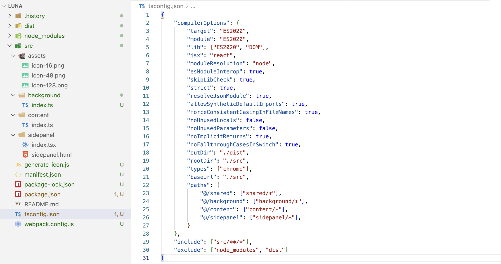
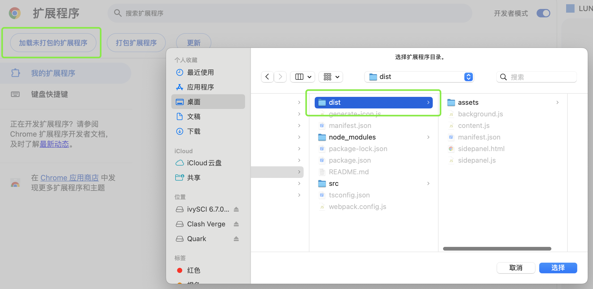
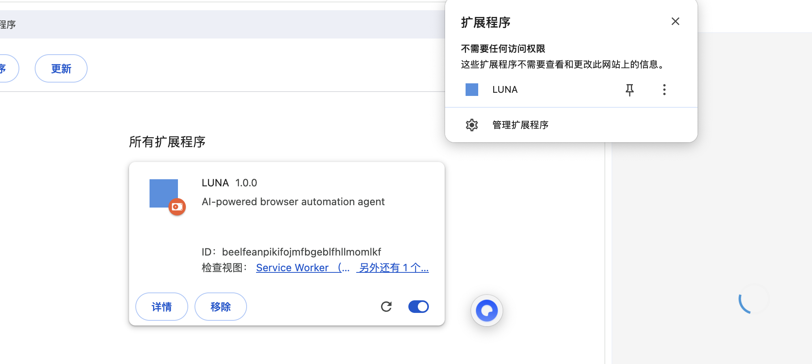

# 形态设想

我计划开发一个具备 Query 和 Agent 两种形态的浏览器插件：

- Query 模式：支持基于页面文字及图片的实时理解和问答；

- Agent 模式：支持基于用户指令的浏览器自动操作。

起初，我并没有对产品形态和技术框架做非常完备的构想和设计，一切都在开发过程中逐步完善。

# 开发过程

这是我第一次开发浏览器插件，此刻正是 **AI Coding**、**Vibe Coding** 大行其道的时代，开发过程中我少不了向 AI 寻求帮助。或是反过来说，如果不是此时此刻，我或许也没有信心零基础开发一个功能完备的浏览器插件。

此外，虽然我打算记录整个开发过程，但也无法期望还会有人以 Agent 时代之前那种古朴的方式阅读这些经验了。

## 原始搭建

### 模块划分

浏览器插件主要包含三大模块：

- Background 后台服务，插件的控制中心

- Content 内容脚本，注入到用户访问的页面

- SidePanel 侧边栏，提供操作界面

### 核心配置

1. manifest.json
浏览器插件的配置中心，用于声明插件的基本信息、权限、入口文件和资源。

    ```
        "background": {
            "service_worker": "background.js",
            "type": "module"
        },

        "side_panel": {
            "default_path": "sidepanel.html"
        },

        "content_scripts": [
            {
                "matches": [
                    "<all_urls>"
                ],
                "js": [
                    "content.js"
                ],
                "run_at": "document_idle",
                "all_frames": true
            }
        ]
    ```

2. package.json
Node.js 项目的依赖管理和构建脚本配置。

3. tsconfig.json
TypeScript 编译器的配置文件，设置编译目标。

4. webpack.config.js
webpack 打包工具的配置文件，定义入口文件和输出目录。

    ```
        entry: {
            background: './src/background/index.ts',
            content: './src/content/index.ts',
            sidepanel: './src/sidepanel/index.tsx'
        },
        output: {
            path: path.resolve(__dirname, 'dist'),
            filename: '[name].js',
            clean: true
        }
    ```

### Icon 准备
浏览器插件需要准备三种尺寸的 Icon，我用脚本生成了纯色图标。

```
const sharp = require('sharp');
const path = require('path');

const assetDir = path.join(__dirname, 'src', 'assets')

const sizes = [16, 48, 128];
const iconColor = '#4A90E2';

function generateSVG(size) {
    return `
        <svg width="${size}" height="${size}" xmlns="http://www.w3.org/2000/svg">
            <rect width="${size}" height="${size}" fill="${iconColor}"/>
        </svg>
    `;
}

async function generateSVGAll() {
    for (const size of sizes) {
        const svg = generateSVG(size);
        const output = path.join(assetDir, `icon-${size}.png`)

        try {
            sharp(Buffer.from(svg))
            .resize(size, size)
            .png()
            .toFile(output)
        } catch (error) {
            console.log(error)
        }
    }
}

generateSVGAll();
``` 

### 运行


像图上这样准备好模块入口和配置文件后，就可以执行

```
npm install
npm run build
```

编译结果会输出到项目根目录的 dist 文件夹。在 Chrome 上选择 dist 作为未打包的扩展程序加载，就可以在插件列表里看见我们的插件了。


