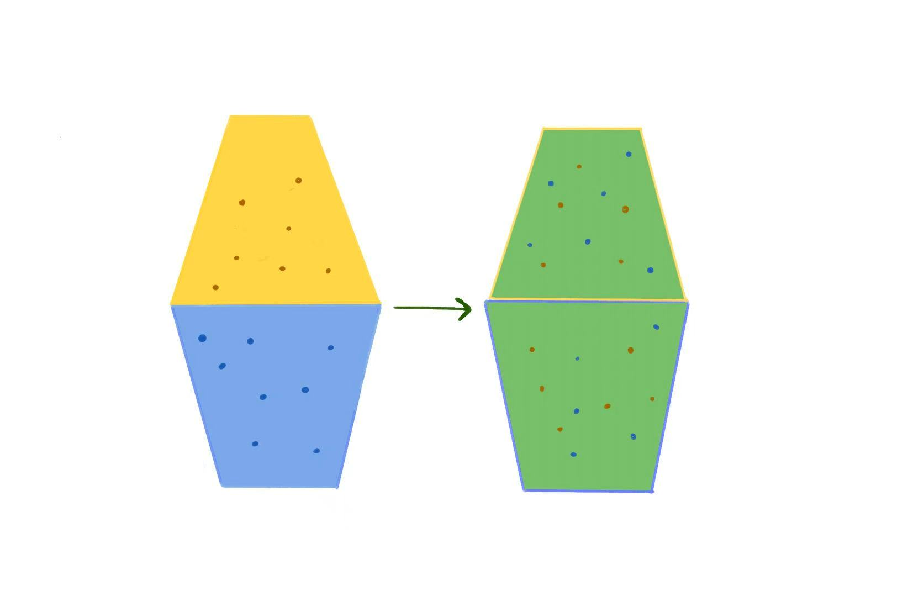
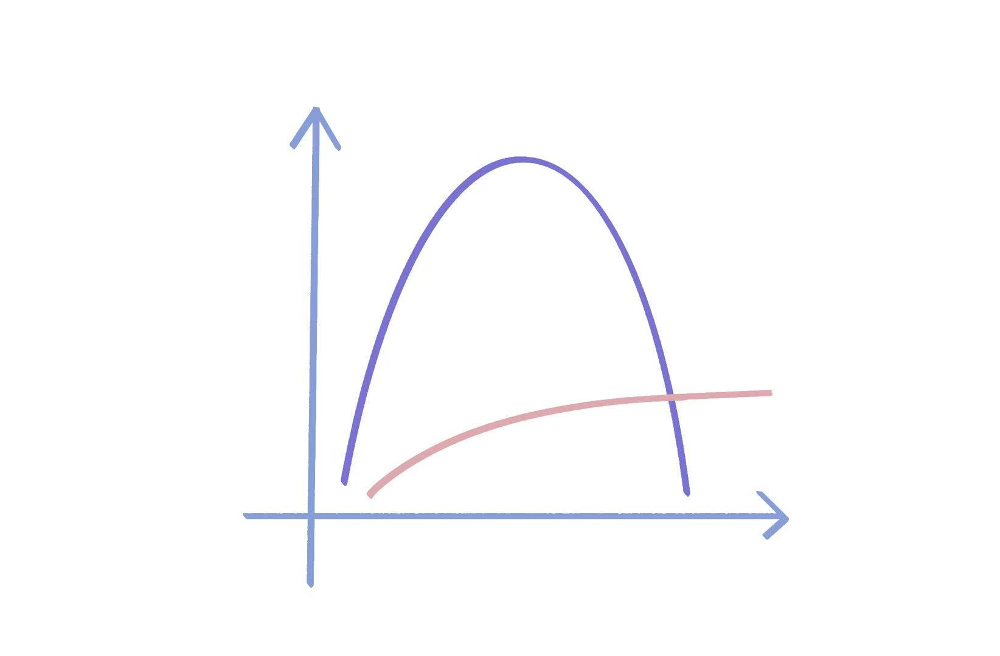

> 我为什么阅读这篇文章：
> 某天在公司排队就餐的时候，我在社交平台上看到一篇帖子：前 OpenAI 科学家伊利亚苏茨克推荐的 30 篇必读文章。帖子声称：“读懂这 30 篇论文，你就掌握了 AI 90%的精髓”。我抱着怀疑的态度将它加入了收藏夹，计划等有空仔细时阅读一番，以验证其所言虚实。「复杂动力学第一定律」便是其首篇。
 
> 「复杂动力学」我也是头次听说，但作为一名对热力学定律感到熟悉的工程热物理的学生，对这篇文章的标题也是颇感亲切。尤其是文中对熵的讨论，更与我曾经的专业课程——热力学——紧密相关，于是我对这篇文章更产生了额外的兴趣。

> 原文：https://scottaaronson.blog/?p=762

# 背景知识预热

## 熵

提到熵，计算机科学背景的读者应该都很熟悉香农信息论中提到的信息熵。但是在本文的背景下，我们还需要了解另一种熵——热力学熵。

### 热力学熵 
热力学熵最早在 1865 年由鲁道夫克劳修斯在研究热力学第二定律时提出，比信息熵早提出约一百年。热力学第二定律描述了能量的方向性，它有数种等价的表述方式：热量不能自发地从低温物体传递到高温物体；孤立系统的总熵不会自发减少，只能增加或者保持不变。

所以到底什么是熵？我初学的时候，也觉得这个概念非常的抽象。直观地理解，熵是一个系统无序和混乱程度的描述。拿一副扑克牌举例，当这幅牌按照花色聚集、按照数字排序时，它的无序程度较低，熵也较低；当这幅牌被随机打乱，随意掺混的时候，它的无序程度较高，熵也较高。

要更细致地去理解，需要结合统计学的视角。想象这样一个画面：一个杯子在上，装着密度更高的黄色液体，另一个杯子在下，装着密度更低的蓝色液体，这两个杯子口对口放置着，中间隔着一张薄片，这是系统的初始状态。把薄片抽开，密度更高的黄色液体将向下流动掺混，密度更低的蓝色液体将向上浮涌，这期间杯中将产生无数难以描述的复杂结构。从宏观的角度来看，两个杯子中的液体最终会停止变化，变成了两杯均匀的绿色液体，这是系统的终态。

在这个过程中熵是如何变化的？答案是：增加。这个答案遵循了热力学第二定律，但为什么？根据玻尔兹曼公式，熵依赖于系统在某个宏观状态下对应的可能微观状态数。那为什么这个过程中，微观状态的可能性是增加的呢？站在微观的视角思考，可以从组成这杯液体的一个分子入手。在初始状态下，一个液体分子有无数个可能存在的位置，但是我们能确定黄色液体分子一定位于上面的杯子，蓝色液体分子一定位于下面的杯子。而在终态下，黄色液体分子、蓝色液体分子它们都既可能位于上面的杯子里，也可能位于下面的杯子里。每个分子统计意义上的微观可能性增加，整个系统的微观可能性更是大大增加。这就是熵增。

## Kolmogorov 复杂度
Kolmogorov 复杂度是算法信息论领域的理论，它给出了一种复杂度的定义方式：一个对象的复杂度等于可以产生这个对象（比如字符串）的程序的最小长度，这里的程序可以用伪代码的角度去思考。

在 Kolmogorov 复杂度定义下，一个长度为 $N$ 的全零字符串的复杂度很低，这个字符串可以用 `print(N * '0')`产生，它的复杂度大约是 $O(\log N)$；而一个长度为 $N$ 的随机字符串 `dsahuwiqkfnkapoasf...` 的复杂度很高，为了产生它，必须用`print('dsahuwiqkfnkapoasf...')`，它的复杂度大约是 $O(N)$。这样定义的复杂度直接依赖于这个对象有没有规律的结构和是否可压缩。对于有规律的对象，它的信息比较容易压缩，可以产生它的程序较短，复杂度低；而对于纯随机的对象，它的信息没有任何规律，无法压缩，复杂度就高。

这样的定义产生了一个问题：人的 DNA 基因复杂度很高，而随机字符串的复杂度同样很高，但这两者似乎没有什么可比性。为此，算法信息论的后续研究提出了一种改进思路：将复杂拆分为两部分：有结构的复杂度 (Sophistication) 和随机噪音的复杂度。

# 回到原文

## 作者写作动机

作者在文中表示，他写这篇文章是尝试去回答 Sean M. Carroll（美国理论物理学家）在学术会议上提出的一个问题：为什么孤立系统的热力学熵是单调增加的，但复杂度或者有趣程度是先增加后降低的？

首先作者给这里的复杂度和有趣程度起了个名字 Complextropy，如何理解呢？回到刚刚提到的两杯液体的场景，相比初始状态和终态，掺混过程态的复杂度和有趣程度一定是更高的。从复杂度上讲，两杯液体掺混时，杯中会产生无数可观察、无法观察并且在各种意义上都难以描述的复杂流动结构；从有趣程度上讲，我想一定有人愿意观赏类似深水炸弹般的分层液体掺混的场景，但我不敢说有人愿意一直盯着两杯宏观上毫无变化的水。

作者在文中还提到了宇宙这个场景。宇宙作为一个孤立系统也是持续熵增的。它从宇宙大爆炸时刻的一锅高能低熵粒子汤开始演变，最终（在人类难以想象和企及的未来）将达到一锅低能高熵粒子汤的热寂时刻。这两个时刻能难说有什么复杂的结构或者说是有趣的，但在中间过程中，即此时此刻，宇宙中却产生了银河、星系、大脑、汽车、人类社会等结构。

> 说实话，我实在难以想象那两个时刻是怎样的。因为彼时和另一个彼时，我都只是粒子汤的一部分。

## Beyond Specification

但为了保持论证的严谨，论述不能仅局限于上文提出的少数个例。作者提出了两个需要回答的核心问题：

- 给出 Complextropy 的形式化定义
- 在该定义下，证明在自然演化的系统中，系统在初始状态和终态的复杂度较低，而在中间状态的复杂度较高。

对于第二个问题，作者首先给出了一个符合直觉的分析。在系统的初始时刻，熵处于一个较低的水平，而熵在某种意义上对系统可能达到的复杂度提供了一个上界约束；而在演化末期，系统趋于热平衡的均衡状态，宏观上的结构消失（例如混合均匀的两杯水），此时系统可以用极为简洁的语言描述，结构复杂度趋于零；而在中间演化过程中，系统既没有被低熵约束，也没有被均衡状态的统计规律抹平，此时复杂度**有机会**增加。

然而，复杂度是如何增长的、可以增长到什么样的规模、Complextropy 如何准确定义，这些问题仍有待确认。

作者表示或许可以将前文的 Kolmogorov 复杂度以及其中的结构复杂度 (Sophistication) 作为工具来解答，并进行了以下形式化的论证。

给定集合 $S$，它是长度为 $n$ 的二进制字符串的集合。$K(S)$ 为集合 $S$ 的 Kolmogorov 复杂度，即描述集合 $S$ 所需的最短程序长度。对于集合中的一个元素 $x$，定义 $K(x|S)$ 为在已知集合 $S$ 的完整描述下，为了唯一确定 $x$ 所需的额外信息量（条件复杂度）。结构复杂度 $\mathrm{Soph}(x)$ 定义为：在满足以下条件时，取遍 $S$ 得到的 $K(S)$ 的最小值：

- $x \in S$；
- $K(x|S) \geq \log_2|S| - c$，其中 $c$ 为容差参数。

这两个条件即：$x$ 是集合 $S$ 中的一个**典型成员**。
> $|S|$ 是集合 $S$ 的大小。在已知结构 $S$ 的前提下，为了唯一确定其中的元素 $x$ 仍需要约 $\log_2|S|$ 的信息量，这表示 $x$ 在 $S$ 中不存在显著的特殊性，类似于从中随机抽取的元素。

初看，Sophistication 衡量了描述产生 $x$ 的结构所需要的信息量，似乎正符合我们希望得到的 Complextropy 的性质：

- 非常简单的字符串（例如全零字符串）的复杂度很低，可取 $S = \{x\}$；
- 完全随机的字符串的复杂度也很低，可取 $S = \{0,1\}^n$；
- 既不简单也不是完全随机的有意义的字符串则具有一定的复杂性，无法取到一个非常简单的 $S$ 描述。

然而，Sophistication 的定义仍存在两处问题：

- 第一个问题：复杂性**增长速率受限**；
> 在确定性系统下，系统状态可由初始状态、演化规律和时间步数 $t$ 唯一确定，因此总能取 $S = S(t)$（$t$ 时刻可能状态的集合），系统的 Sophistication 无法超过 $\log(t) + c$。在概率系统下也类似：若演化在各状态上均匀，则 $t$ 时刻的状态是 $S(t)$ 的典型成员，描述 $S(t)$ 仍仅需初始状态、演化规律与 $t$，复杂性仍受 $\log(t) + c$ 限制。即复杂性至多按对数速率增长，与真实世界中中间状态复杂性明显变大的现象不符。

- 第二个问题：复杂性**缺乏下降机制**。
> Sophistication 的定义为：给定 $x$，在满足「$x$ 是集合 $S$ 的典型成员」的条件下，取遍 $S$，求描述集合 $S$ 所需最短程序长度。问题在于，该定义对程序运行所需时间资源和算力资源未作任何限制。在这种无资源限制的情况下，即便是最复杂的系统，我们仍可以用极短的程序作出描述：物理定律 + 初始状态 + 时间步数 $t$。于是系统的中间状态和终态都可以通过此类描述得到，系统的复杂性不仅在增长上受到对数率的限制，且由于终态对应的时间步 $t$ 大于中间状态，终态的复杂性将高于中间过程，不满足我们想要的「中间过程复杂性高、初始状态和终态复杂性低」的分布要求。

在这里还需要额外说明：为什么不直接对终态作出「均衡」或「随机」的简单描述？由于无计算资源限制，我们总能基于物理定律 + 初始状态 + 时间步数，以小于 $\log(t) + c$ 的复杂度从 S 重构 x，即 $K(x|S) \leq \log(t) + c$。而均衡描述下的集合 S 将包含数量极多的微观状态，$|S|$极大，$\log|S|$远大于 $log(t)$。此时 $x$ 是 $S$ 典型成员的要求：$K(x|S) \geq \log|S| - c$ 的条件无法满足，我们不能直接用「均衡」对终态作出描述。

作者在文中提出解决问题的关键，即在于对两处的程序施加资源限制：
- 第一处：描述集合 $S$ 的程序必须在限定时间或算力下运行；
> 在此资源受限的条件下，中间状态无法通过初始状态、演化规律和时间步数，在无限制的计算资源下缓慢运行得到，我们需要用更复杂的程序去直接描述中间状态的结构，因此中间状态的复杂度得以提高。

- 第二处：基于 $S$ 重构 $x$ 的程序也必须在限定资源下运行。
> 终态无法通过简单程序基于 $S$ 定位 $x$，我们可以直接对终态作出「均衡」的描述，终态的复杂度得以下降。

最终，初始状态复杂度低、中间状态复杂度高、终态复杂度又下降的分布就此达成。

> 其实过去两三年，我经常零散地在互联网上阅读和学习各种文章、课程，期间做的笔记也写了两三本，但像这样完整地记录学习和思考的过程还是第一次。

> 记录的过程中为了保持准确，我搜索了很多资料，让我意识到，有很多我以为我知道、了解、已经学会和理所应当的知识背后，还可以继续追问真的吗、为什么。

